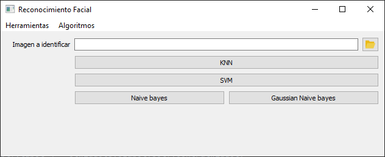

# Artificial_Vision

## Overview
This is a python program capable of detecting by means of a convolutional neural network the position of faces in images. 
It is also able to detect whose face is in the images using computer vision algorithms.
The algorithms used to detect the faces are as follows

- KNN.
- SVM.
- Bernoulli Naive Bayes.
- Gaussian Naive Bayes.

Author: Manuel Fernández Miguélez.

## Interface
In the interface the user can see the time it has taken to detect the faces of the image with each of the algorithms used for the detection.
After training the system by detecting images with the different algorithms the user can save the detection results in the file Artificial_vision/Interface/log.csv.

## Dependencies
- Python 3.6.2
- Keras 2.4.3
- Tensorflow 2.4.0
- PyQt5 5.15.2
- opencv-python 4.4.0.46
- scikit-learn 0.24.0

## Usage
Open Pycharm, select the correct version of the python interpreter.
Then click on:
1. File
2. Settings
3. Project
4. Python Interpreter.
And install the appropriate libraries mentioned above.